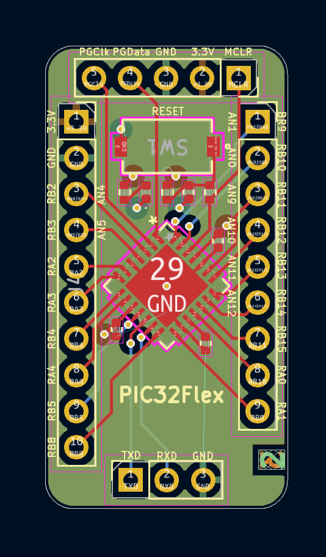

# PIC32Flex 

PIC32Flex is a breakout board for the PIC32MX170F256B. This repo holds schematic revision information, how to facbricate this board for yourself, and examples on how to use the boar. I designed this board for rabid prototyping, testing, and better wire management for projects and circuits that use the PIC32 as a microcontroller. Specifically, I made PIC32Flex for Stanford's ME218 mechatronics course sequence which exclusively uses the PIC32 as the microcontroller for all student projects. For this reason, it is wired to interface directly with the [MPLAB Snap](https://www.microchip.com/en-us/development-tool/pg164100) and the [CP2102 debugger](https://www.silabs.com/interface/usb-bridges/classic/device.cp2102?tab=specs).

  
  

## Download and Modification

To modify or view a revision of PIC32Flex, download any version of the board from the `hardware/` directory. All revisions were made using [KiCad 8.0](https://www.kicad.org/download/) which is a free PCB design software. Once downloaded, extract the file into the directory of your choice and open the `PIC32Flex.kicad_pro` file. This should open up a the KiCad start page where you can choose to view and then modify the schematic, PCB layout, and most other features related to the board. KiCad files are not backwards compatable so you may need to upgrade to KiCad 8.0 if you are working with an older version. If you download the most recent version and open the schematic editor you will find the following.

  

Opening the PCB editor of the latest version should present the following PCB layout.

  

